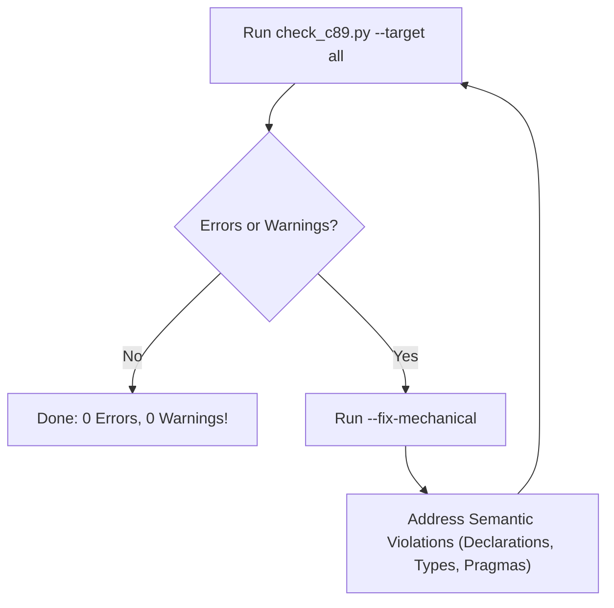

# C89 Multi-Target Conformance & Build Skill

This skill provides an automated build, diagnostic, and remediation workflow for ensuring strict **C89 / ANSI C** conformance across both supported targets:
1. **Linux**: Built via `make -f makefile.linux` using GCC with `-std=c89 -pedantic -Wall -Wextra`.
2. **Watcom DOS**: Built via `wmake -f makefile.watcom-linux build` (or `wmake build` under DOS) using OpenWatcom `wcc386` with `-za -w4`.

---

## Quick Workflow Summary



---

## Step 1: Run the Multi-Target Conformance Checker

Execute the bundled verification script from the project root:

```bash
# Full build and error/warning audit for both targets:
python3 .agents/skills/c89-conformance/scripts/check_c89.py --target all

# Or run static scan only without building:
python3 .agents/skills/c89-conformance/scripts/check_c89.py --scan
```

Helper script wrapper:
* [`check_c89.py`](./scripts/check_c89.py)
* [`run_c89.sh`](./scripts/run_c89.sh)

The tool parses and displays:
* Build status for `LINUX` and `DOS`
* Total counts of errors and warnings per target
* Exact file, line numbers, error codes, and messages

---

## Step 2: Auto-Fix Mechanical C89 Syntax Issues

To automatically fix mechanical violations across all `.c` and `.h` files:

```bash
python3 .agents/skills/c89-conformance/scripts/check_c89.py --fix-mechanical
```

This safely resolves:
1. **C++ single-line comments (`// ...`)**: Replaced by standard C89 `/* ... */` block comments without modifying string literals or existing comment blocks.
2. **Enum trailing commas**: Removes trailing commas before `}` in `enum` definitions.
3. **Missing EOF newline**: Appends a newline to files lacking one (resolving Watcom `Warning! W138`).

---

## Step 3: Resolve Semantic & Compiler Issues

Consult the [C89 Reference Guide](./references/c89_reference.md) and apply the following rules:

### 1. Variable Declarations Mixed with Code (`-Wdeclaration-after-statement`)
In C89, variables **must** be declared at the top of the function or block scope before any statements.
Follow the project's variable hierarchy rule from `.agents/rules/c-code-stlye.md`:
* Signed primitives (`int`, `long`, `char`)
* Unsigned primitives (`unsigned int`, `unsigned char`)
* `bool`
* Structs / typedef'd structs
* Pointer types (always initialized to `NULL` at the top)

### 2. Disallow `long long` (`-Wlong-long`)
* Replace `long long` with `unsigned long` or `long` (e.g. for millisecond timestamps or offsets).

### 3. Watcom Auxiliary Assembly Pragmas (`#pragma aux`) with `-za`
When OpenWatcom compiles with `-za` (strict ANSI C), extension keywords are disabled. Use double-underscore tokens:
* Change `parm [dx]` to `__parm [__dx]`
* Change `value [al]` to `__value [__al]`
* Change `modify [ax bx cx dx]` to `__modify [__ax __bx __cx __dx]`
* Always provide a prototype declaration for the assembly function before calling it.

### 4. Extended ASCII & Character Literal Overflow (`-Woverflow`)
* For CP437 box-drawing and UI characters (`0xB0`, `0xC9`, `177`, `218`), use `unsigned char` instead of `char` to avoid signed integer overflow warnings and unwanted sign extension.

### 5. Standard POSIX Function Prototypes under C89
* When `-std=c89` is enabled in GCC, feature test macros must precede system includes:
  ```c
  #ifndef _DEFAULT_SOURCE
  #define _DEFAULT_SOURCE
  #endif
  #ifndef _POSIX_C_SOURCE
  #define _POSIX_C_SOURCE 200809L
  #endif
  ```
* For Watcom C, prototype non-standard library functions (e.g. `char *strdup(const char *s);`).
* To expose `spawnl` and `P_WAIT` in Watcom under `-za`, undefine `_NO_EXT_KEYS` before `#include <process.h>`.

---

## Step 4: Verification

Re-run the multi-target checker:
```bash
python3 .agents/skills/c89-conformance/scripts/check_c89.py --target all
```

Verify that the output displays:
```text
Target LINUX: [SUCCESS] - 0 error(s), 0 warning(s)
Target DOS: [SUCCESS] - 0 error(s), 0 warning(s)
ALL TARGETS COMPILED CLEANLY UNDER C89! (0 errors, 0 warnings)
```
